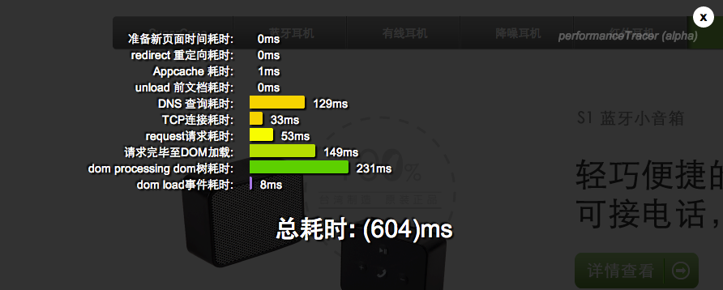

performanceTracer
=================

查看performance API 耗时统计

###注意事项
__由于window.performance.timing还处于w3c完善过程中，当你的网站有异步请求时，请在所有异步请求完成后再点击chrome上的插件按钮，以确保数据正确__

##使用方法

####1、直接在html文件中引用
<pre><code>"performance-min.js"
</code></pre>

####2、安装chrome插件
由于chrome商店发布应用要收money，本人是穷X，就不发布了，直接从crx文件夹内下载performance-tracer.crx 文件，然后拖到chrome浏览器内即可安装。

###效果图

###performance timming时段结构图参考
    

